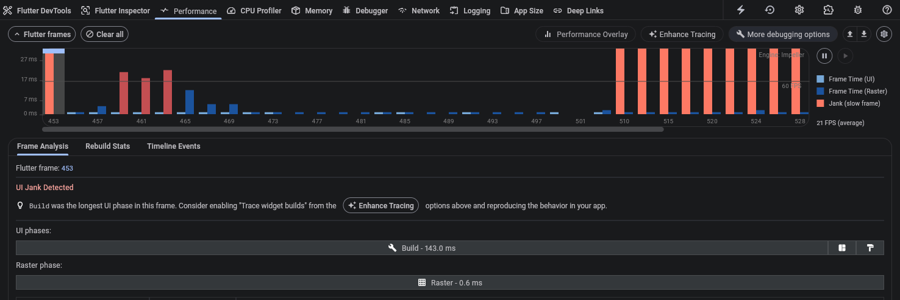
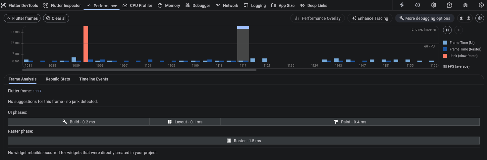
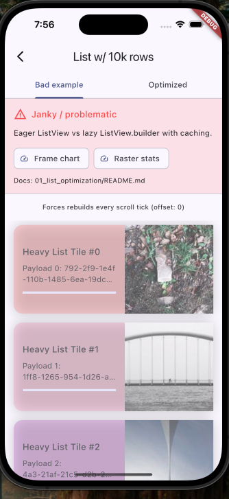

# 01 - List Optimization

Demonstrates how an eager `ListView` with 10,000 widgets destroys frame rates, while `ListView.builder` with cached data maintains smooth 60 FPS scrolling.

## The Problem

Use `ListView(children: [...])` with thousands of items, Flutter builds **every single widget** on each frame—even items not visible on screen.

---

## Bad Example (`bad_example.dart`)

Uses eager `ListView` that builds all 10,000 widgets at once:

```dart
ListView(
  children: List.generate(10000, (index) {
    // Every widget built on EVERY frame
    return ListTile(
      title: Text('Item $index - ${_generateRandomString()}'),
      subtitle: Text(_computeExpensiveValue(index)),
    );
  }),
)
```

### Performance Results



| Metric | Value | Status |
|--------|-------|--------|
| **Build time** | 143.0 ms | 9x over budget (target: <16ms) |
| **Raster time** | 0.6 ms | OK |
| **FPS** | 21 FPS | 65% below target |
| **UI Jank** | Detected | Constant stuttering |

**Diagnosis:** The Build phase at 143ms is the bottleneck. For 60 FPS, each frame must complete in under 16.67ms. At 143ms per frame, we're losing ~8-9 frames for every frame rendered.

---

## Good Example (`good_example.dart`)

Uses `ListView.builder` with pre-cached data:

```dart
// Data generated ONCE in initState
final List<ItemData> _cachedItems = List.generate(
  10000, 
  (i) => ItemData(id: i, title: 'Item $i', subtitle: 'Details...'),
);

// Only visible items are built
ListView.builder(
  itemCount: _cachedItems.length,
  itemBuilder: (context, index) {
    final item = _cachedItems[index];
    return ListTile(
      key: ValueKey(item.id),
      title: Text(item.title),
      subtitle: Text(item.subtitle),
    );
  },
)
```

### Performance Results



| Metric | Value | Status |
|--------|-------|--------|
| **Build time** | 0.2 ms | Well under budget |
| **Layout time** | 0.1 ms | Minimal |
| **Paint time** | 0.4 ms | Fast |
| **Raster time** | 1.5 ms | OK |
| **FPS** | 58 FPS | Near perfect |
| **UI Jank** | None | Smooth scrolling |

**Result:** "No suggestions for this frame - no jank detected." DevTools confirms zero widget rebuilds for directly created widgets.

---

## 📊 Summary: Improvement Metrics

| Metric | Bad | Good | Improvement |
|--------|--------|---------|-------------|
| **Build time** | 143.0 ms | 0.2 ms | **99.86% faster** |
| **FPS** | 21 | 58 | **176% increase** |
| **Total frame time** | ~144 ms | ~2.2 ms | **98.5% faster** |
| **Jank** | Constant | None | **Eliminated** |

---

## Key Techniques

| Technique | Bad | Good |
|-----------|--------|---------|
| List type | `ListView(children: [...])` | `ListView.builder()` |
| Data generation | During build | Pre-cached in `initState` |
| Widget keys | None | `ValueKey(id)` |
| Widgets built per frame | All 10,000 | Only ~20-30 visible |
| Build time | 143 ms | 0.2 ms |

---

## How to Reproduce

1. Run the app: `flutter run`
2. Navigate to **01 - List Optimization**
3. Open Flutter DevTools > **Performance** tab
4. Select **Bad Example** tab, scroll aggressively
5. Observe red/orange jank bars and ~21 FPS
6. Switch to **Optimized** tab, repeat scroll
7. Observe smooth blue bars and ~58 FPS

---

### Visual Symptoms of Jank
- Blurry/ghosting card edges during scroll
- Visible stuttering and frame drops
- Unresponsive feel when flinging



---

## Why This Matters

A **715x improvement** in build time (143ms → 0.2ms) demonstrates the critical importance of lazy loading in Flutter lists. This single optimization transforms an unusable, janky scroll experience into buttery-smooth 58 FPS performance.
